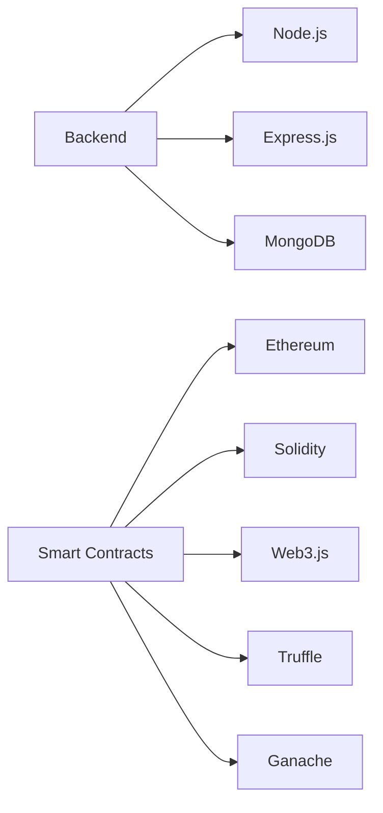

# Easyhost

Easyhost aims to provide a simple architecture for people to build web3 native accommodation marketplaces or booking pages for hosts. This is a work in progress and is not yet ready for production use.

## Getting Started

These instructions will get you a copy of the project up and running on your local machine for development and testing purposes. 

### Prerequisites

To run this project, you'll need:

* Node.js (v14.x or higher)
* Yarn (optional, you can use npm instead)
* MetaMask browser extension
* Ganache or another Ethereum development network
* MongoDB Atlas account (optional, you can use a local MongoDB instance instead)

### Installation

1. Clone the repository:

```bash
git clone https://github.com/xdaluca/easyhost.git
```

2. Install the dependencies:

```bash
cd easyhost
yarn install # or "npm install"
```

3. Compile and deploy the smart contract:

Replace the `bookingAddress` variable in `bookingOnChain.js` with your contract address.

4. Set up your local Ethereum network:

Start Ganache or another Ethereum development network and connect MetaMask to it.

5. Set up the database:

Connect your MongoDB instance to the backend server. You can use a local MongoDB instance or MongoDB Atlas.

7. Start Ganache or another Ethereum development network and connect MetaMask to it.

```bash
ganache-cli
```

8. Start the backend server:

```bash
cd backend
node app.js
```

You can now test the API endpoints using Postman or another API testing tool.

Example POST request to create a booking:

```json
    "propertyId": 1,
    "userAddress": "0xaddress from ganache-cli",
    "checkInDate": 1673846400,
    "checkOutDate": 1673932800,
    "totalAmount": 100
```

Example result:

```json
    "blockchainResult": {
        "transactionHash": "0x1283495312dd99a6e25a866e380f85d046b40e024227d0114b83f487bfdb1930",
        "transactionIndex": 0,
        "blockHash": "0x5d0f87d01eaf966940c8ccf0652632331ac4298e5d86aaf6210f19eea5d34c14",
        "blockNumber": 3,
        "from": "0x0f2879385a6551f7f14674b87b37bdc125c806e1",
        "to": "0x1fda306e7eadee82564328b58286cc2ca2d4bd13",
        "gasUsed": 21684,
        "cumulativeGasUsed": 21684,
        "contractAddress": null,
        "status": true,
        "logsBloom": "0x00000000000000000000000000000000000000000000000000000000000000000000000000000000000000000000000000000000000000000000000000000000000000000000000000000000000000000000000000000000000000000000000000000000000000000000000000000000000000000000000000000000000000000000000000000000000000000000000000000000000000000000000000000000000000000000000000000000000000000000000000000000000000000000000000000000000000000000000000000000000000000000000000000000000000000000000000000000000000000000000000000000000000000000000000000000",
        "events": {}
    },
    "booking": {
        "property": "1",
        "user": "0x0F2879385A6551f7f14674b87B37BdC125C806E1",
        "checkInDate": "1970-01-20T08:57:26.400Z",
        "checkOutDate": "1970-01-20T08:58:52.800Z",
        "totalAmount": 100,
        "bookedDates": [],
        "_id": "645134fafaf90d902caa5de7",
        "__v": 0
```

## Project Architecture

As this is a work in progress, the architecture is subject to change, I would like to change the db to a more decentralized solution, but for the sake of setting it up, it is using MongoDB.



## Contributing

If anyone is interested in contributing to this please reach out, It would be great to review the architecture and see if there are any foundational improvements that can be made before doing more implementation work.

## License

This project is licensed under the MIT License - see the [LICENSE.md](LICENSE.md) file for details

Happy Hosting.